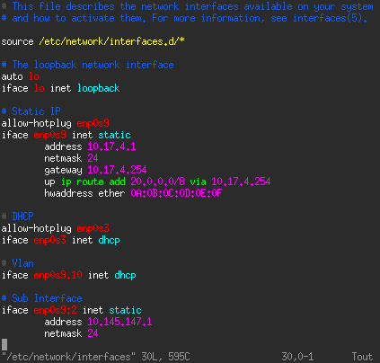

# What is this ?

* Syntax highlighting of /etc/network/interfaces for **vim**

* It is based on https://github.com/baitsalem/vim-interfaces



* Remaining features to be implemented: IPv6

# Installation

* Copy files in /usr/share/vim/vim82/
```bash
cp -R ftdetect ftplugin syntax /usr/share/vim/vim82/
```

* If not already do, enable syntax highlighting in vim
```bash
echo 'syntax on' >> /etc/vim/vimrc.local
```
